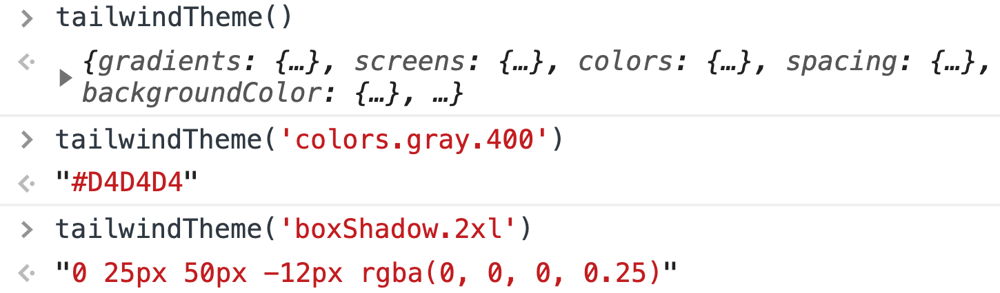

# Tailwind Theme Helper

This helper allows easily to pull the needed value from the Tailwind config.

## Usage



## Requirements

- lodash
- tailwindcss

## Implementation

```js
import resolveConfig from 'tailwindcss/resolveConfig';
import tailwindConfig from '../../../tailwind.config'; // your path to the tailwind.config
import get from 'lodash/get';
import cloneDeep from 'lodash/cloneDeep';

const theme = resolveConfig(tailwindConfig)['theme'];

export default (path = null, defaultValue = null) => cloneDeep(path !== null ? get(theme, path, defaultValue) : theme);
```